# az400-azure-boards-agile-planning
# Azure Boards Agile Planning and Portfolio Management

## Project Overview

This project demonstrates Agile planning and portfolio management using Azure DevOps Boards as part of AZ-400 DevOps Engineer certification preparation.

## Objectives

* Manage Teams and Area Paths
* Configure Iterations and Sprints
* Create and Manage Work Items
* Sprint Capacity Planning
* Customize Kanban Boards
* Create Project Dashboards
* Implement Scrum-based Agile Practices

## Technologies Used

* Azure DevOps
* Azure Boards
* Scrum Framework
* Kanban Boards

## Skills Demonstrated

* Agile Planning
* Sprint Management
* Portfolio Management
* Work Item Tracking
* Capacity Planning
* Dashboard Reporting

## Project Structure

* docs/ - Project documentation
* screenshots/ - Azure DevOps screenshots
* diagrams/ - Architecture and workflow diagrams

## Status

In Progress

## Exercise 1 - Team Management

### Team Creation

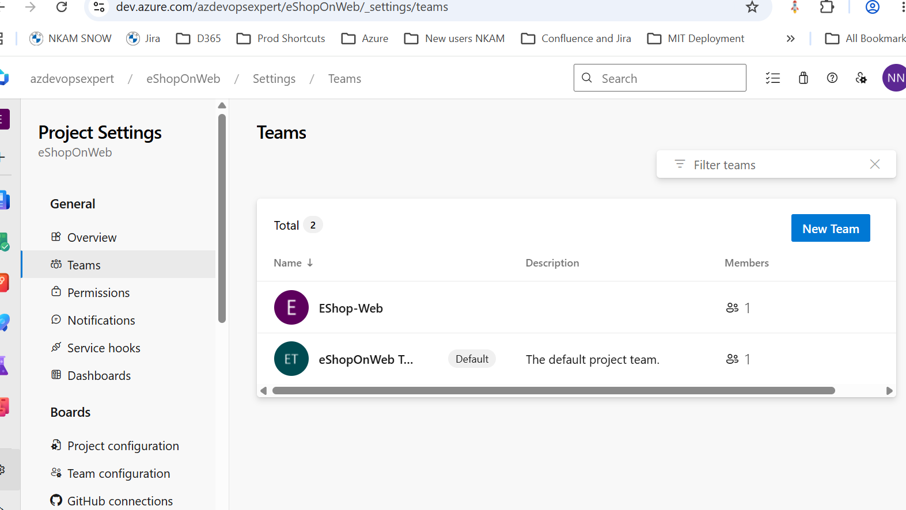

### Sprint Configuration

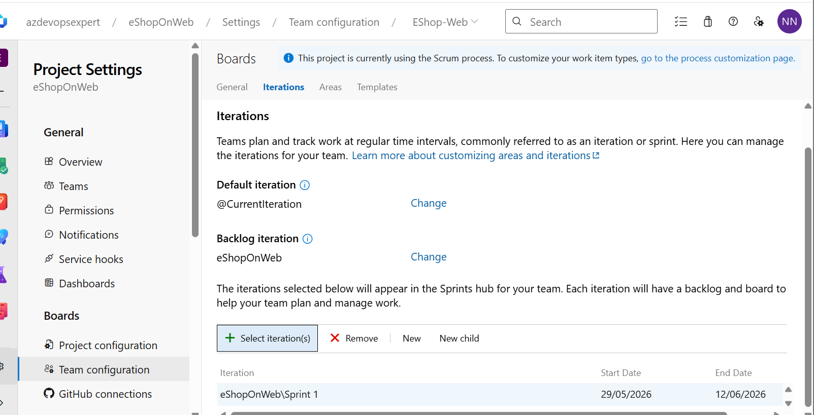

### Area Paths

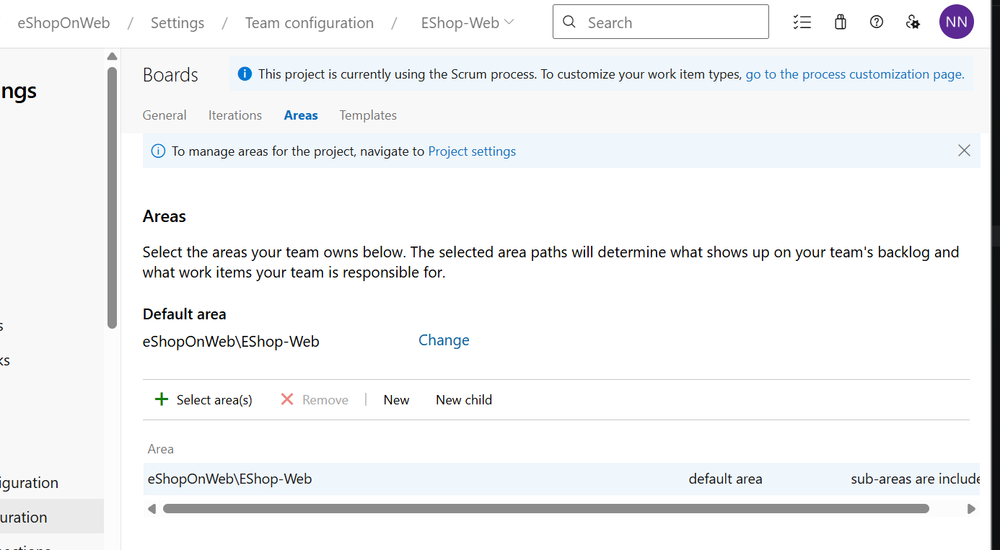

## Exercise 2 - Work Item Management

### Epic and Feature Hierarchy

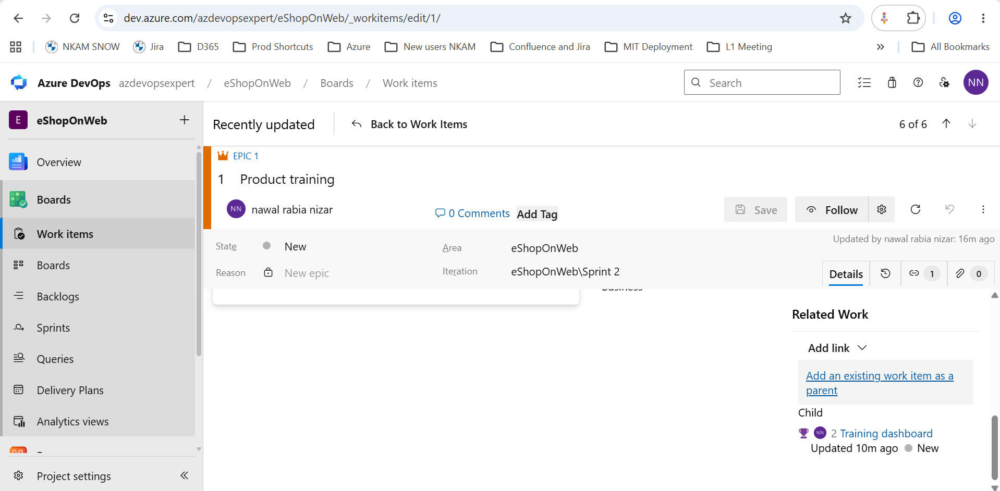

### Product Backlog Items

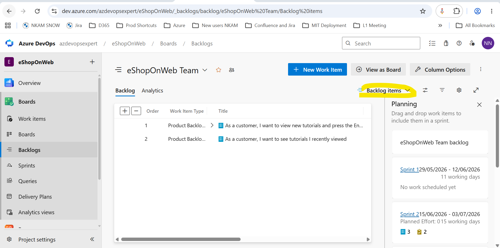
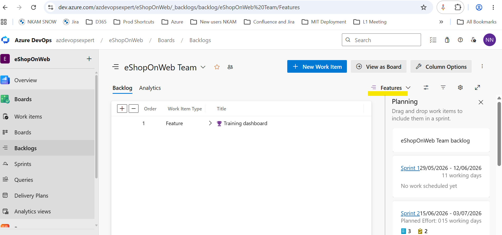

### Tasks

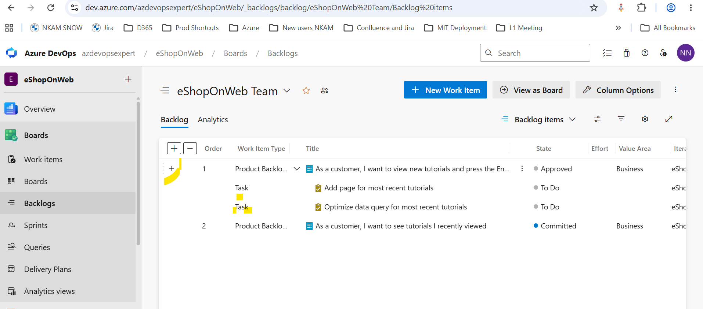

## Exercise 3 - Sprint Management

### Capacity Planning

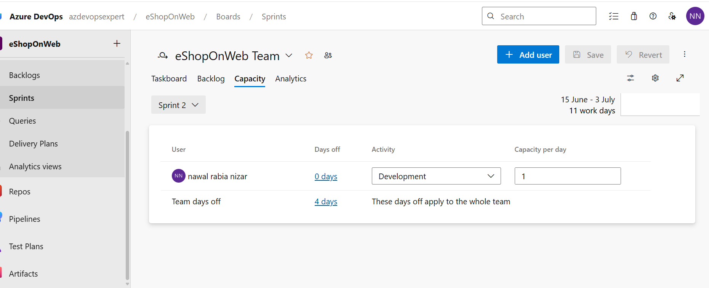

### Sprint Taskboard

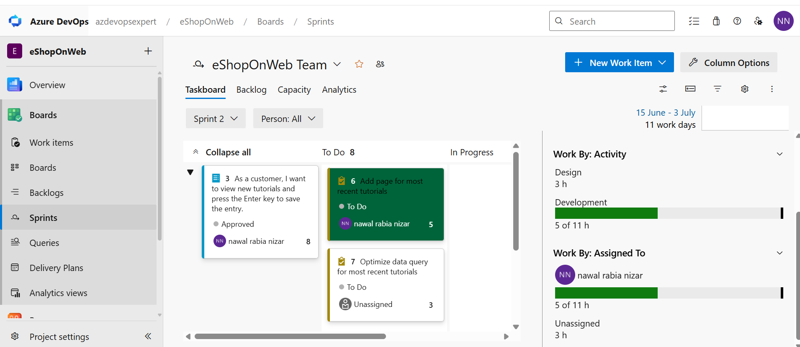

### Over Capacity Example

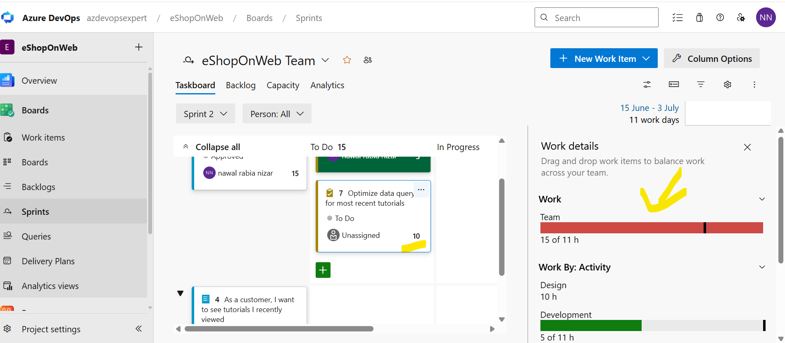

### Styling Rules

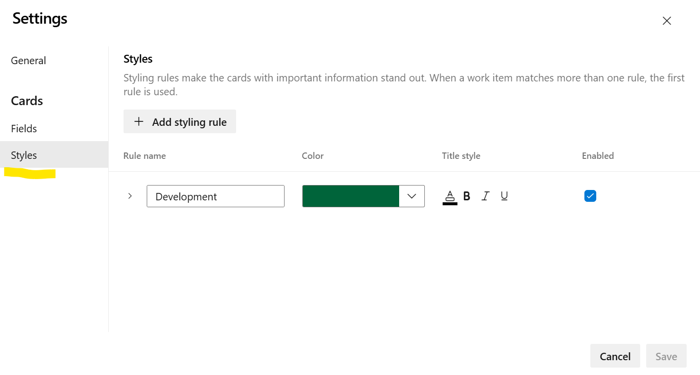

## Exercise 4 - Kanban Board Customization

### Tags

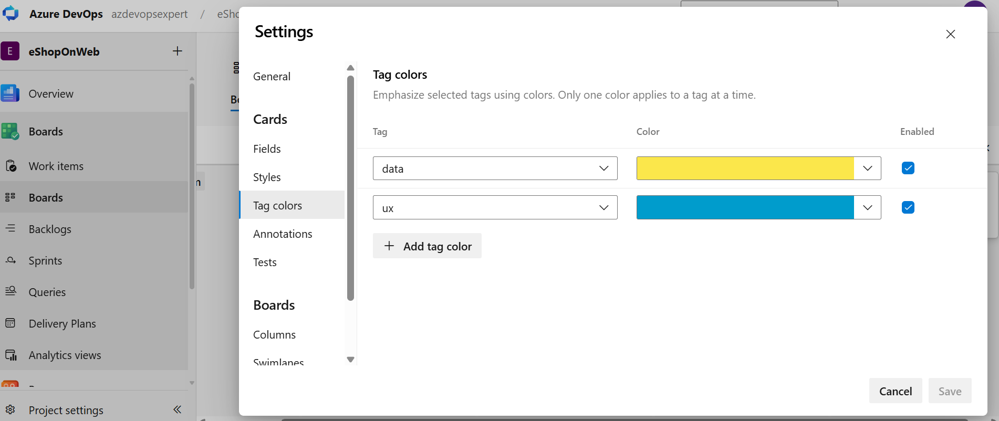

### QA Approved Column

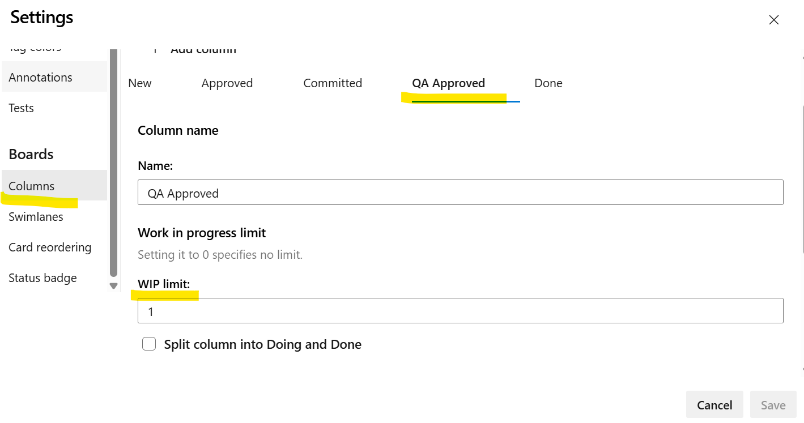

### WIP Limit

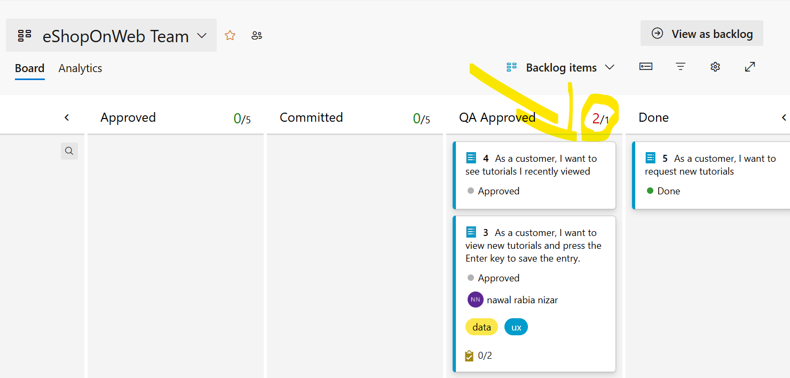

### Split Columns

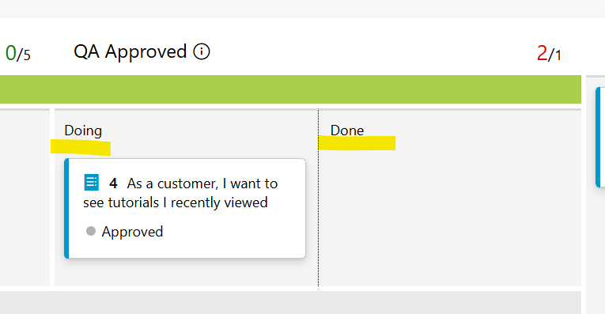

### Expedite Swimlane

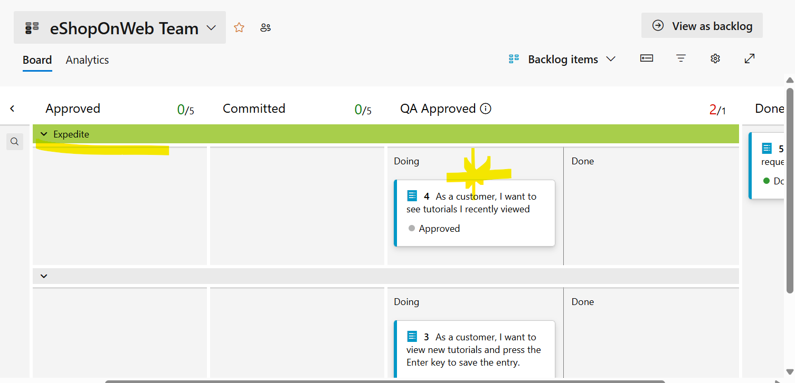