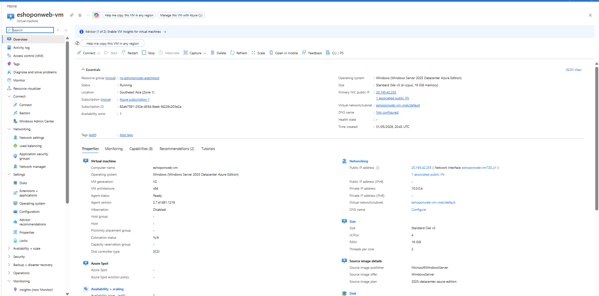
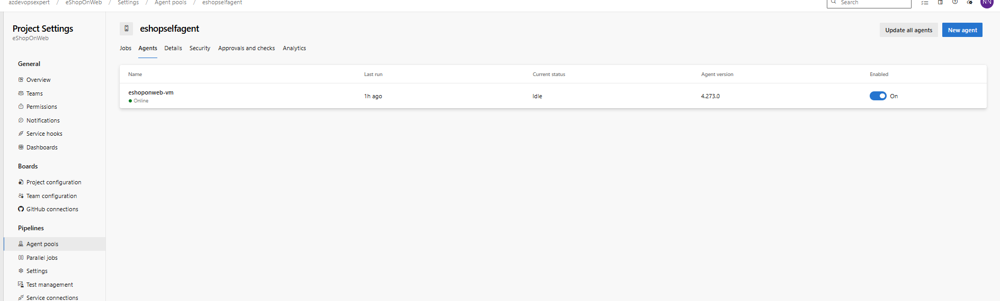
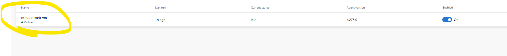
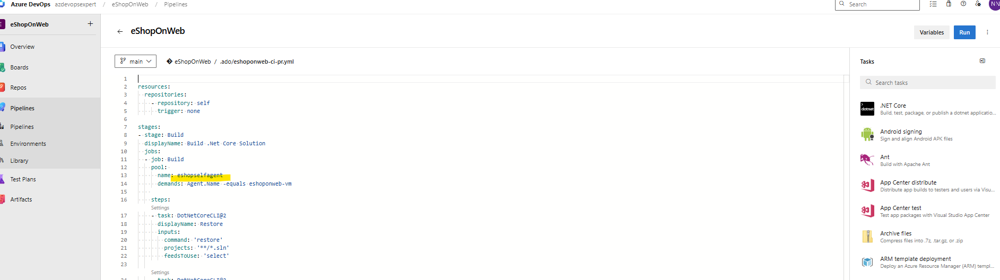
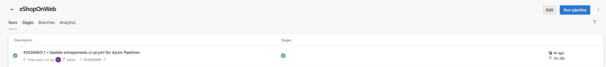

# Lab 02 - Configure Agent Pools and YAML Pipelines

## Overview

This lab demonstrates how to:

- Create Self-Hosted Azure DevOps Agents
- Configure Agent Pools
- Generate PAT Tokens
- Deploy and Register Azure DevOps Agents
- Create YAML-based Pipelines
- Execute CI Pipelines using Self-Hosted Agents

---

## Architecture

Azure VM
↓
Self-Hosted Agent
↓
Agent Pool
↓
Azure DevOps YAML Pipeline
↓
Application Build

---

## Key Tasks

### Create Azure VM

### Create Agent Pool

### Register Self Hosted Agent

### Configure YAML Pipeline

### Successful Pipeline Run

---

## Skills Demonstrated

- Azure DevOps
- Azure Pipelines
- YAML
- CI/CD
- Self Hosted Agents
- Azure Virtual Machines
- PAT Authentication

---

## Result

Successfully executed CI pipeline using a self-hosted Azure DevOps agent running on an Azure Virtual Machine.