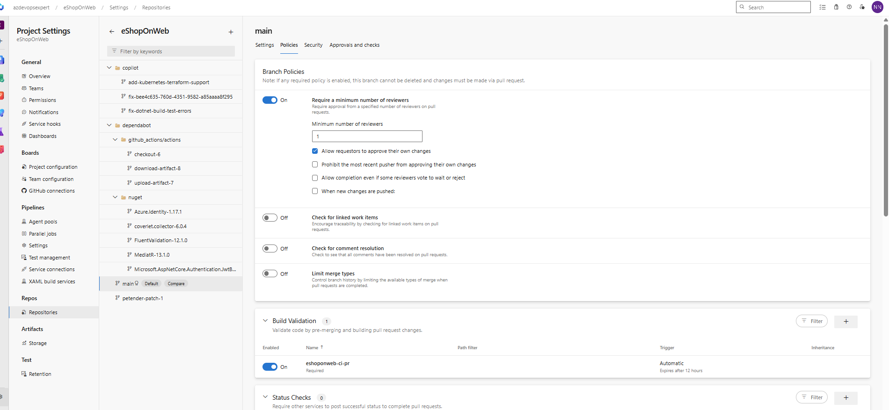
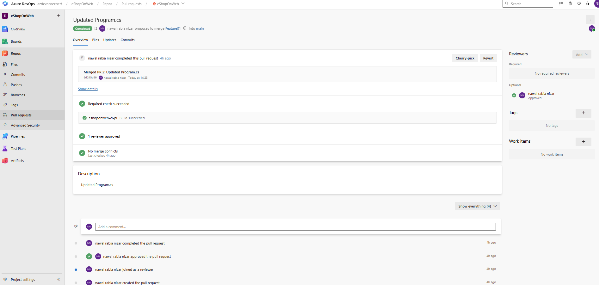
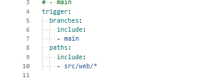
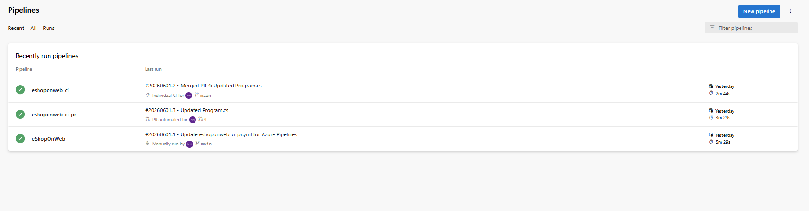
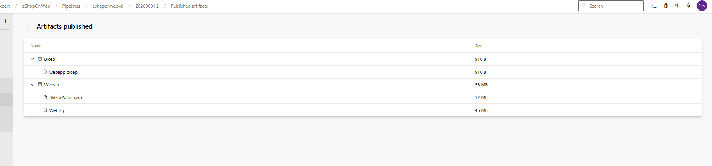

# Lab 03 - Enable Continuous Integration with Azure Pipelines

## Overview

This lab demonstrates how to implement Continuous Integration (CI) and Pull Request validation using Azure DevOps YAML pipelines.

---

## Objectives

- Configure Pull Request validation
- Apply Branch Policies
- Require code reviews before merge
- Configure CI pipelines using YAML
- Publish build artifacts automatically
- Trigger builds on code changes

---

## Architecture

Developer
↓
Feature Branch
↓
Pull Request
↓
Build Validation Pipeline
↓
Merge to Main
↓
Continuous Integration Pipeline
↓
Published Artifacts

---

## Branch Policies



Configured:

- Minimum 1 reviewer
- Build validation required

---

## Pull Request Validation


Azure DevOps automatically validates:

- Code review requirements
- Successful build execution

---

## PR Validation Pipeline



Pipeline:

- Restore
- Build
- Test
- Publish

---

## CI Pipeline Trigger



YAML trigger configured for:

```yaml
trigger:
  branches:
    include:
      - main
```

---

## Successful CI Execution



---

## Published Artifacts



Artifacts generated:

- Website
- Infrastructure (Bicep)

---

## Skills Demonstrated

- Azure Repos
- Branch Policies
- Pull Requests
- Build Validation
- Azure Pipelines
- YAML
- Continuous Integration
- Artifact Publishing

---

## Result

Implemented Pull Request validation and Continuous Integration using Azure DevOps YAML pipelines.