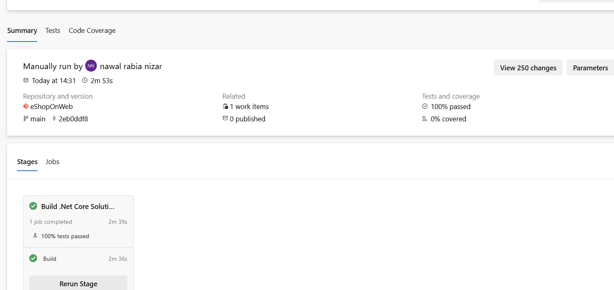

# 🚀 Azure DevOps CI/CD: Docker Deployment to Azure App Service

## 📌 Overview

This lab demonstrates an end-to-end CI/CD pipeline using Azure DevOps to:

- Build a Docker image from a .NET 8 web application
- Push the image to Azure Container Registry (ACR)
- Deploy the container to Azure App Service using Bicep (IaC)

The project is based on the Microsoft eShopOnWeb sample application.

---

## ⚙️ Tech Stack

- Azure DevOps (YAML Pipelines)
- Docker
- Azure Container Registry (ACR)
- Azure App Service (Linux Containers)
- Bicep (Infrastructure as Code)
- .NET 8

---

## 🔄 CI/CD Workflow

### CI Pipeline
- Builds Docker image using Azure DevOps hosted agent
- Tags image as `latest` and build ID
- Pushes image to Azure Container Registry

### CD Pipeline
- Deploys infrastructure using Bicep
- Configures Azure App Service with container support
- Pulls Docker image from ACR
- Deploys running web application

---

## 📸 Screenshots

All screenshots from the lab execution are available in the [`screenshots/`](./screenshots) folder.

### CI Pipeline

### Docker Image in ACR

### CD Pipeline

### Azure App Service Deployment

### Running Application

---

## 🧱 Infrastructure

Provisioned using Bicep templates:
- Azure Container Registry
- Azure App Service Plan
- Web App (Linux container)
- RBAC role assignment (AcrPull)

---

## 🧠 What I Learned

- Building CI/CD pipelines in Azure DevOps
- Docker image creation and deployment workflow
- Using Azure Container Registry (ACR)
- Deploying containerized apps to Azure App Service
- Infrastructure as Code with Bicep

---

## 📂 Repository Structure
