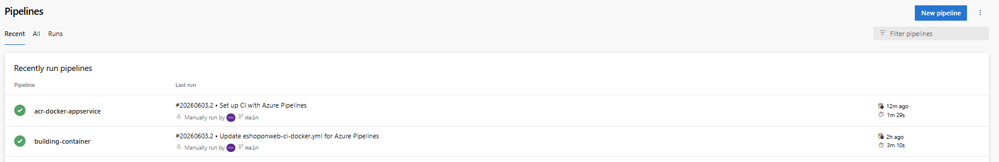
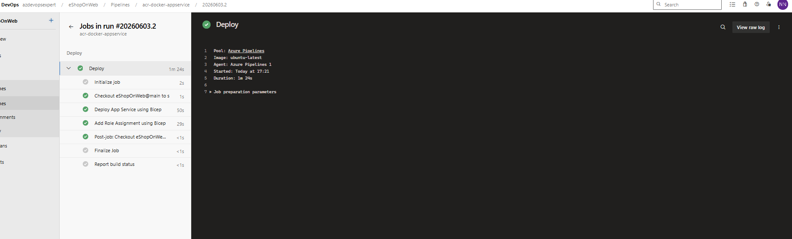
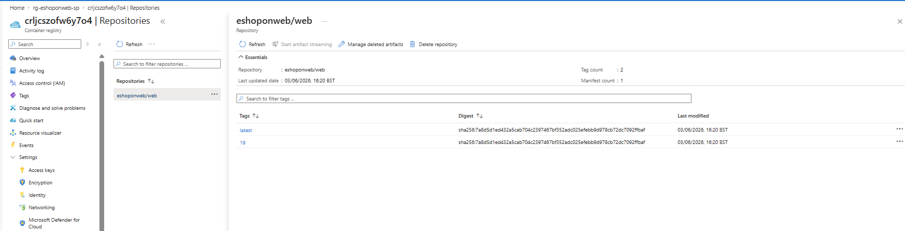
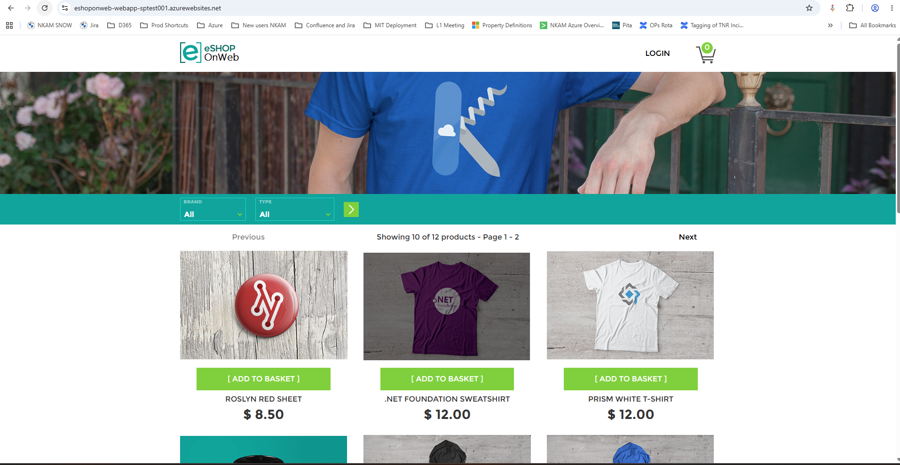
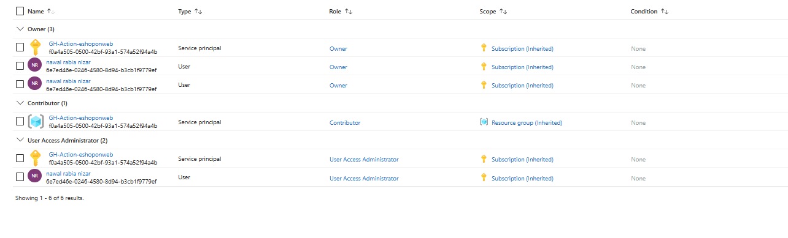

# Lab 6: Deploy Docker Containers to Azure App Service using Azure DevOps

## Overview
This project demonstrates a full CI/CD pipeline that builds a Docker container, pushes it to Azure Container Registry, and deploys it to Azure App Service using Azure DevOps and Bicep.

## Architecture
Azure DevOps → Docker Build → ACR → Bicep → App Service → Live App

## Technologies Used
- Azure DevOps
- Docker
- Azure Container Registry
- Azure App Service
- Azure Bicep
- Azure RBAC

## CI/CD Workflow
1. Build Docker image using Azure DevOps pipeline
2. Push image to Azure Container Registry
3. Deploy infrastructure using Bicep templates
4. Assign AcrPull role to App Service
5. Deploy containerized application

## Key Learning Outcomes
- Implemented CI/CD pipeline for containerized application
- Understood Azure RBAC for secure access
- Used Infrastructure as Code (Bicep)
- Automated deployment to Azure App Service

## Screenshots

### Pipeline Success

### Azure Container Registry

### App Service Running

### Live Application

### RBAC Configuration

## Author
Nawal Rabia 