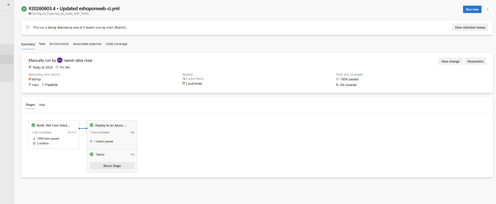
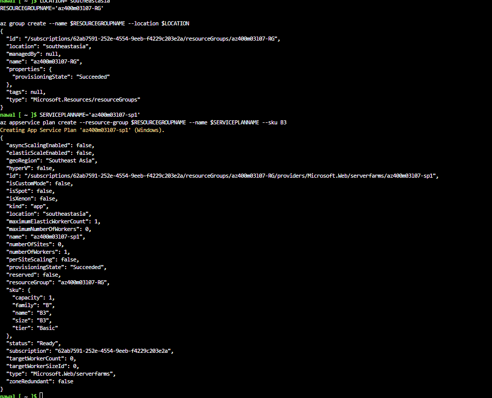
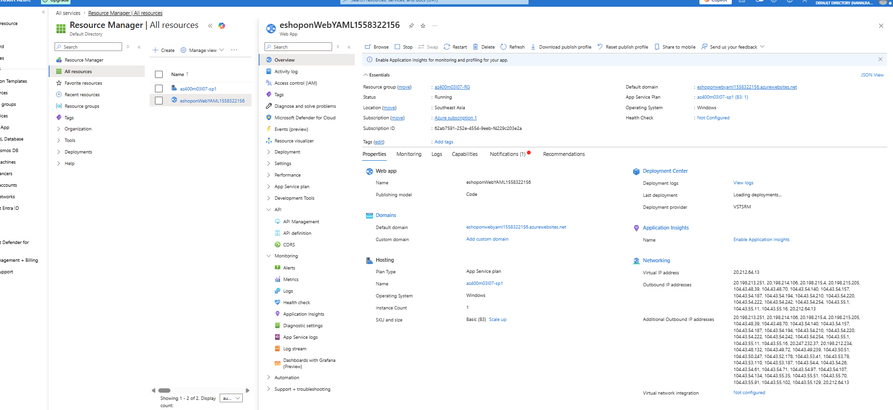
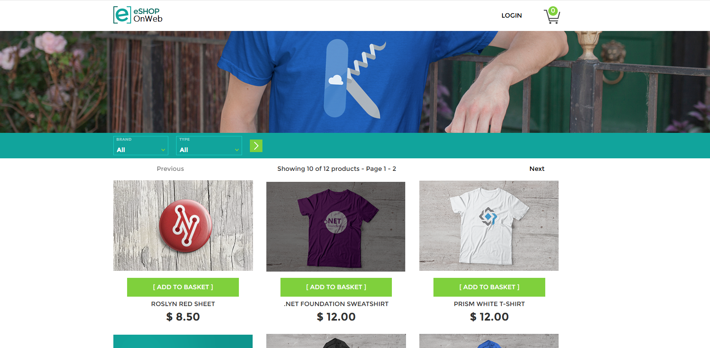
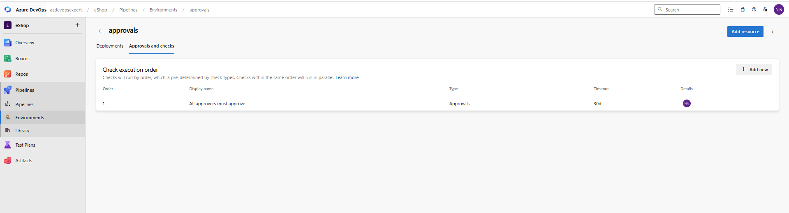
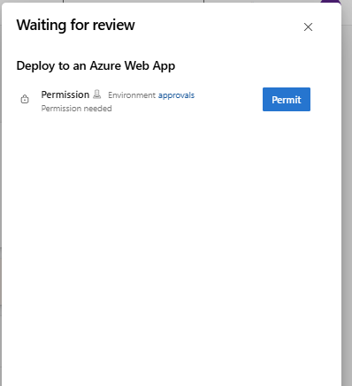
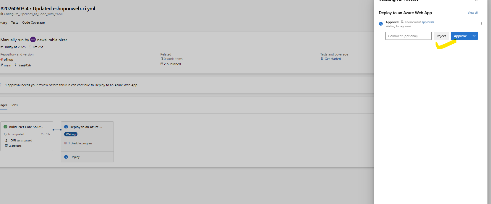

# Lab 7: Configure CI/CD Pipelines as Code with YAML in Azure DevOps

## 📌 Overview

This project demonstrates how to implement a complete **CI/CD pipeline using YAML in Azure DevOps**.

The pipeline:
- Builds a .NET application
- Runs tests
- Publishes build artifacts
- Deploys the application to Azure App Service
- Implements approval-based deployment using Azure DevOps Environments

---

## 🏗️ Architecture

Azure DevOps Pipeline
↓
Build (.NET app)
↓
Test
↓
Publish Artifact
↓
Deploy to Azure App Service
↓
Manual Approval (Environment Check)
↓
Live Web App

---

## 🚀 Technologies Used

- Azure DevOps Pipelines (YAML)
- .NET 8 Application
- Azure App Service
- Azure Environments (Approvals)
- Git Repos (Azure Repos)
- Infrastructure as Code (Bicep - optional reference)

---

## ⚙️ Pipeline Stages

### 1. Build Stage
- Restore dependencies
- Build solution
- Run unit tests
- Publish artifacts

### 2. Deploy Stage
- Download build artifacts
- Deploy to Azure App Service
- Configure application settings

### 3. Approval Stage
- Manual approval using Azure DevOps Environments
- Controlled production-like deployment flow

---

## 🔐 Key DevOps Concepts Learned

- CI/CD pipeline as code (YAML)
- Multi-stage pipeline design
- Artifact management
- Azure App Service deployment
- Manual approval gates (Environments)
- Secure deployment workflows

---

## 📸 Screenshots

### 1. Pipeline Success (Build + Deploy)

Shows successful completion of both Build and Deploy stages.

---

### 2. Build Stage Logs

Displays Restore, Build, Test, and Publish tasks executed successfully.

---

### 3. Azure App Service Overview

Shows the deployed Azure App Service and application URL.

---

### 4. Live Website

The deployed eShopOnWeb application running in Azure.

---

### 5. Environment Approval Check

Manual approval gate configured through Azure DevOps Environments.

---

### 6. Deployment Stage Logs

Shows successful deployment to Azure App Service.

