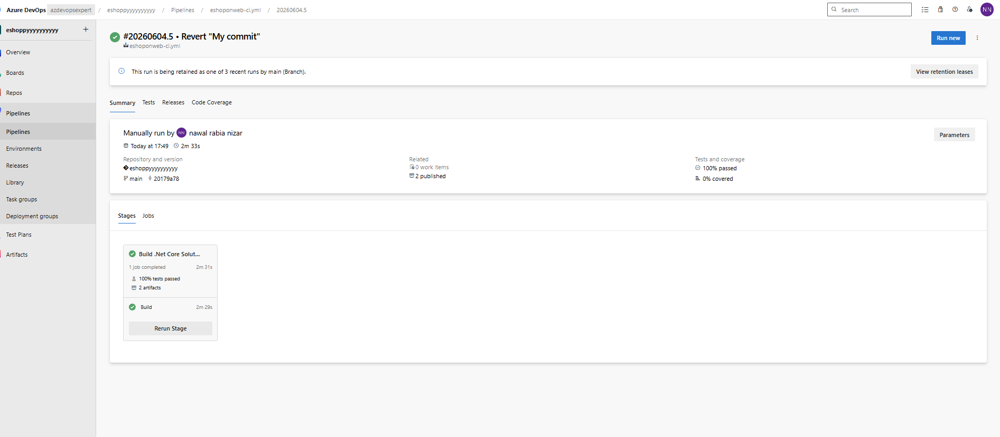
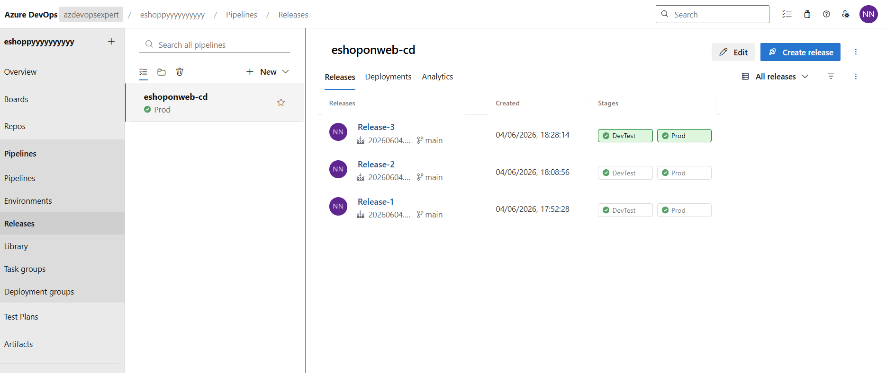
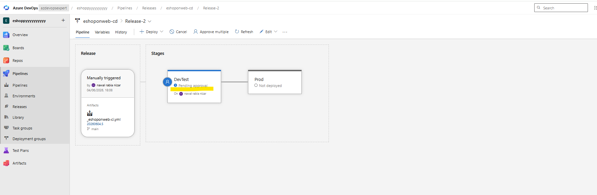
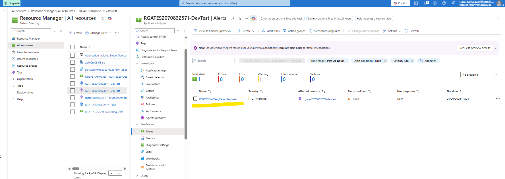
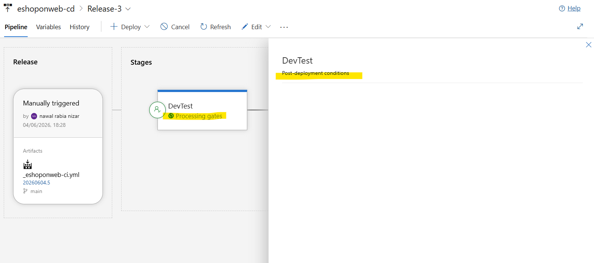
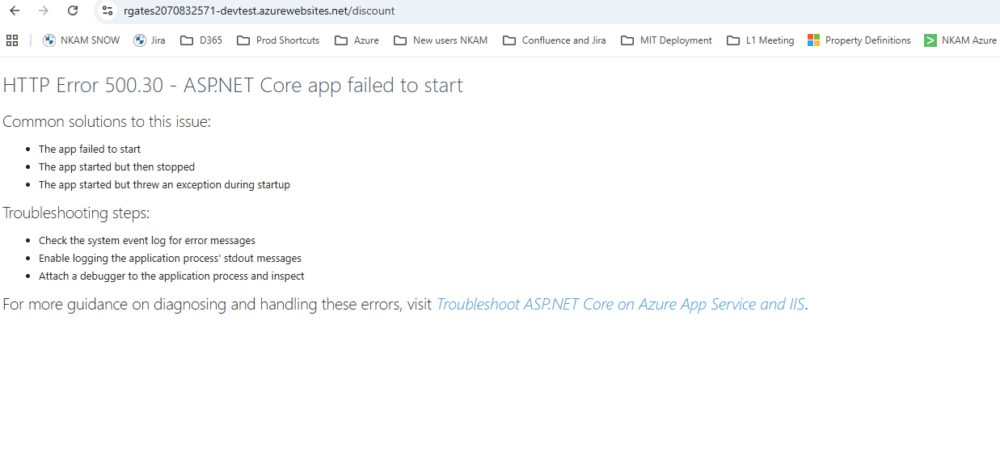
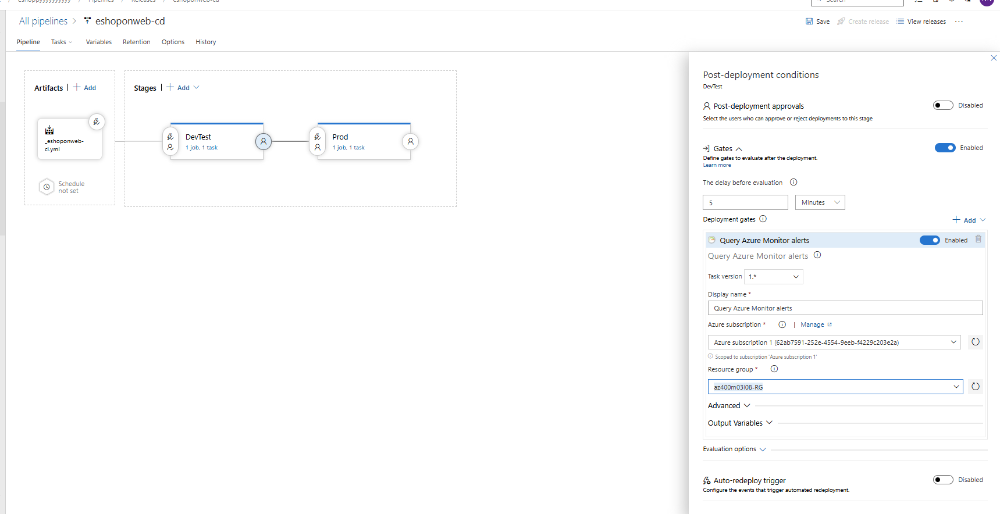

# 🚀 Control Deployments using Release Gates (Azure DevOps)

## 📌 Overview

This project demonstrates how to implement **controlled CI/CD deployments using Azure DevOps Release Pipelines**, including:

- Multi-stage deployments (DevTest → Production)
- Manual approvals before deployment
- Automated release gates using Azure Monitor
- Application Insights integration for deployment safety

The goal is to simulate a real-world DevOps pipeline where production releases are controlled, validated, and monitored.

---

## 🏗️ Architecture

- **Azure DevOps CI Pipeline (YAML)** – Builds and publishes artifacts  
- **Azure DevOps Release Pipeline (Classic)** – Manages deployments  
- **Azure App Service** – Hosts DevTest and Production environments  
- **Application Insights** – Monitors application health  
- **Azure Monitor Alerts** – Acts as release gates  

---

## 🔄 CI/CD Workflow

1. Code pushed to repository
2. CI pipeline builds .NET 8 application
3. Build artifact (Web.zip) generated
4. Release pipeline triggered automatically
5. Deployment to **DevTest environment**
6. Manual approval required before DevTest deployment
7. Post-deployment gate checks Azure Monitor alerts
8. If healthy → deployment proceeds to **Production**

---

## 🔐 Release Gates Implementation

### ✅ Pre-Deployment Gate (Approval)
- Manual approval required before DevTest deployment
- Ensures human validation before release

### 🚦 Post-Deployment Gate (Azure Monitor)
- Queries Application Insights alerts
- Blocks promotion if:
  - Failed requests exist
  - Active alerts are detected
- Automatically re-evaluates every few minutes

---

## 🧪 Test Scenario

To validate the release gates:

- Triggered a failed request using `/discount`
- Application Insights detected errors
- Severity 2 alert was generated
- Release gate detected issue and controlled deployment flow

---

## 📸 Screenshots

### 🧩 CI Pipeline (Build Success)

---

### 🚀 Release Pipeline Stages (DevTest & Production)

---

### 🔐 Pre-Deployment Approval Gate

---

### 📊 Application Insights Alert

---

### 🚦 Post-Deployment Gate Configuration

---

### ⚠️ Failed Request Triggered (/discount)

---

### ⏳ Gate Evaluation Blocking/Allowing Deployment

---

## 🧠 Key Learnings

- How to implement enterprise-grade release controls
- Using Azure Monitor as a deployment quality gate
- Integrating observability into CI/CD pipelines
- Managing safe production deployments with approvals + automation

---

## 🔥 Why This Project Matters

This setup reflects real-world DevOps practices used in production systems:

- Prevents faulty deployments
- Enforces governance and approvals
- Integrates monitoring into release decisions
- Reduces production incidents through automated quality checks

---

## 📁 Repository Structure
