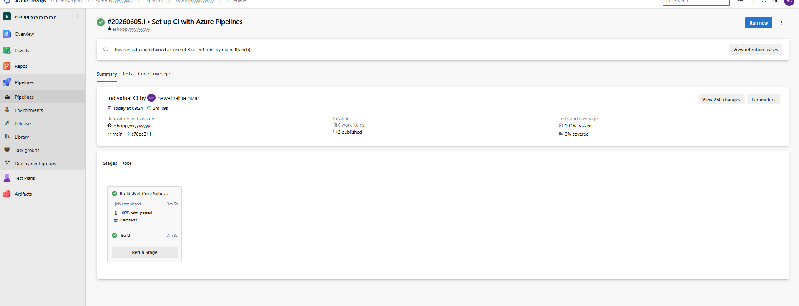
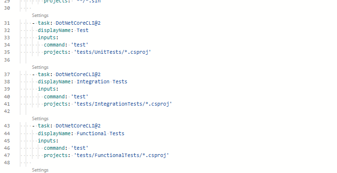
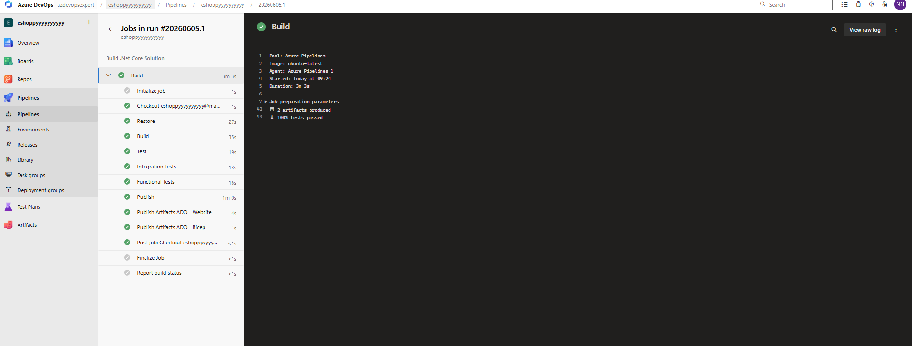
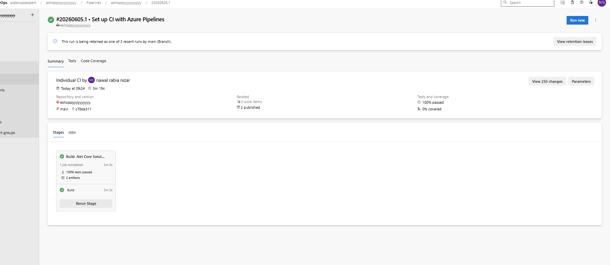
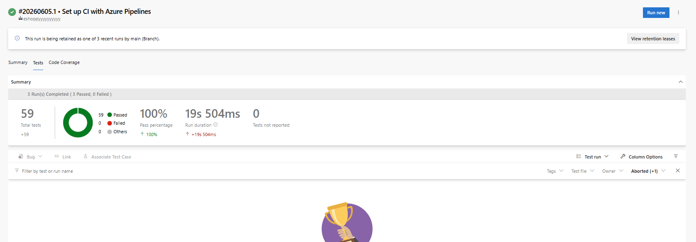

# 🧪 Set Up and Run Functional Tests with Azure DevOps

## 📌 Overview

This project demonstrates how to implement automated testing within an Azure DevOps Continuous Integration (CI) pipeline for a .NET application.

The pipeline executes multiple layers of testing to improve software quality and catch defects early in the development lifecycle:

* Unit Tests
* Integration Tests
* Functional Tests

The implementation uses the eShopOnWeb reference application and Azure DevOps YAML pipelines.

---

## 🎯 Objectives

* Configure a YAML-based CI pipeline in Azure DevOps
* Execute automated Unit Tests
* Execute Integration Tests
* Execute Functional Tests
* Analyze test execution results within Azure DevOps

---

## 🏗️ Solution Architecture

Developer Commit
↓
Azure Repos
↓
Azure DevOps YAML Pipeline
↓
Restore Dependencies
↓
Build Application
↓
Unit Tests
↓
Integration Tests
↓
Functional Tests
↓
Publish Artifacts

---

## 🔧 Technologies Used

* Azure DevOps
* Azure Pipelines (YAML)
* .NET 8
* xUnit Testing Framework
* Azure Repos
* eShopOnWeb Sample Application

---

## 🚀 CI Pipeline Configuration

### Restore Dependencies

The pipeline restores all required NuGet packages before compilation.

```yaml
- task: DotNetCoreCLI@2
  displayName: Restore
  inputs:
    command: restore
```

### Build Application

The application and its dependencies are compiled.

```yaml
- task: DotNetCoreCLI@2
  displayName: Build
  inputs:
    command: build
```

### Unit Tests

Unit tests validate individual components and business logic in isolation.

```yaml
- task: DotNetCoreCLI@2
  displayName: Unit Tests
  inputs:
    command: test
```

### Integration Tests

Integration tests validate interactions between application layers and dependencies.

```yaml
- task: DotNetCoreCLI@2
  displayName: Integration Tests
  inputs:
    command: test
    projects: 'tests/IntegrationTests/*.csproj'
```

### Functional Tests

Functional tests validate system behavior from an end-user perspective.

```yaml
- task: DotNetCoreCLI@2
  displayName: Functional Tests
  inputs:
    command: test
    projects: 'tests/FunctionalTests/*.csproj'
```

---

## 📊 Testing Strategy

### Unit Tests

Purpose:

* Validate individual methods and classes
* Fast execution
* No external dependencies

### Integration Tests

Purpose:

* Verify interactions between services
* Validate data access and infrastructure integration
* Confirm application layers work together correctly

### Functional Tests

Purpose:

* Validate complete business workflows
* Simulate real user behavior
* Ensure application requirements are met

---

## 📸 Screenshots

### Azure DevOps Pipeline Run



---

### YAML Pipeline with Test Tasks



---

### Successful Build and Test Execution



---

### Test Summary Dashboard



---

### Detailed Test Results



---

## 📈 Results

The pipeline successfully:

* Restored project dependencies
* Built the application
* Executed Unit Tests
* Executed Integration Tests
* Executed Functional Tests
* Published build artifacts

All tests completed successfully and generated detailed reporting within Azure DevOps.

---

## 🧠 Key Learnings

* Implementing automated testing in CI pipelines
* Understanding the software testing pyramid
* Executing multiple test types within Azure DevOps
* Analyzing test results and failures
* Improving release confidence through automated validation

---

## 🔥 Real-World Value

Organizations use automated testing pipelines to:

* Detect defects early
* Reduce production failures
* Improve deployment confidence
* Enforce quality gates
* Support Continuous Integration and Continuous Delivery (CI/CD)

---

## 📁 Repository Structure

```text
azure-devops-functional-testing
│
├── screenshots
│   ├── pipeline-run.png
│   ├── pipeline-yaml.png
│   ├── build-success.png
│   ├── test-summary.png
│   └── test-results.png
│
└── README.md
```

---

## ✅ Conclusion

This project demonstrates how Azure DevOps can be used to automate multiple levels of testing within a CI pipeline, ensuring code quality and reducing risk before deployment. By incorporating Unit, Integration, and Functional Tests into the build process, teams can achieve faster feedback cycles and more reliable software releases.
