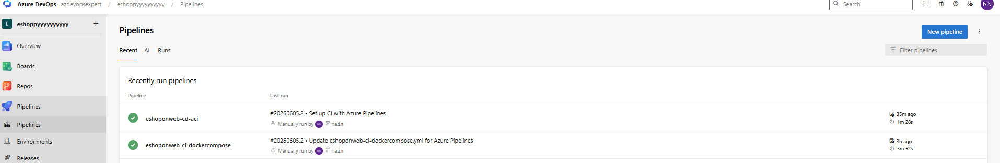
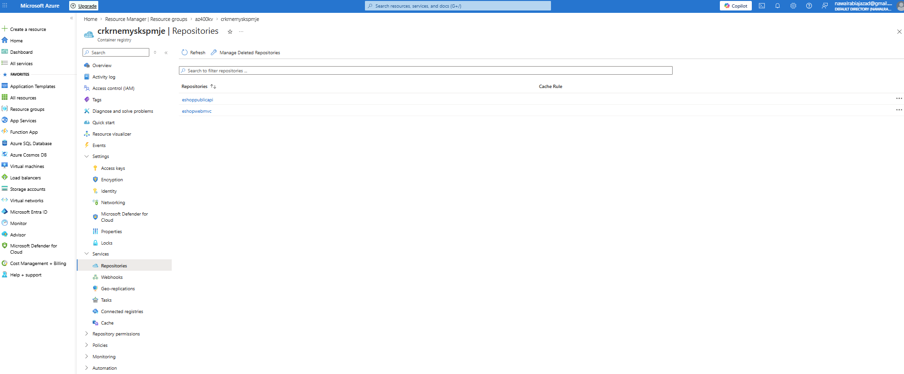
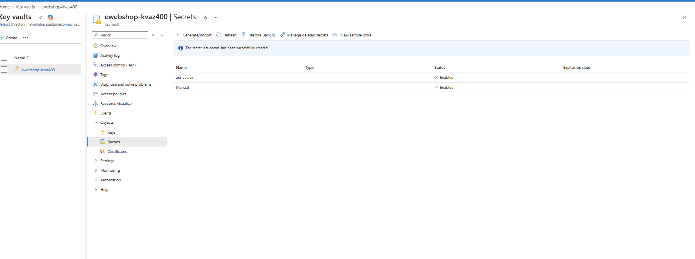
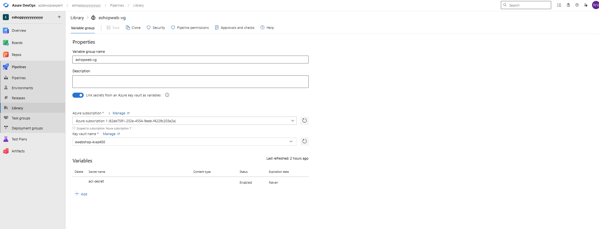
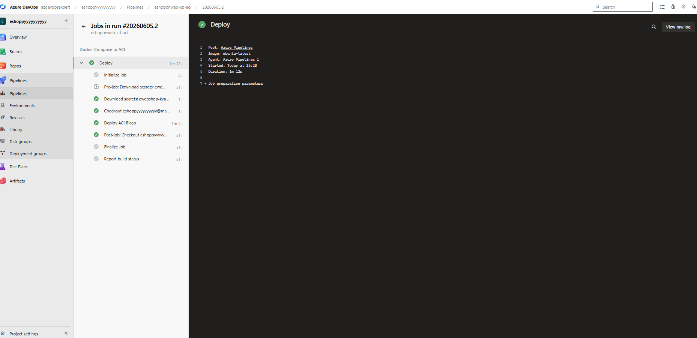
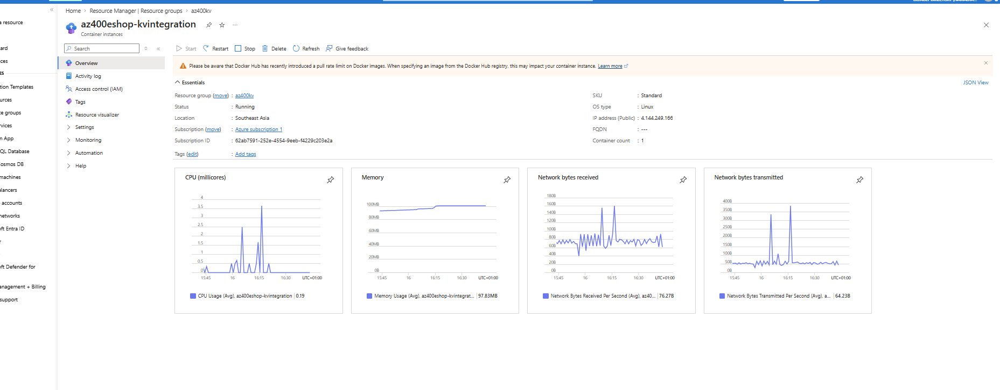

# Azure DevOps CI/CD – Deploy eShopOnWeb Containers to Azure Container Instances

## Overview

This project demonstrates an end-to-end CI/CD implementation using Azure DevOps, Docker, Azure Container Registry (ACR), Azure Key Vault, Bicep Infrastructure as Code, and Azure Container Instances (ACI).

The pipeline automates:

* Building containerized ASP.NET applications
* Publishing images to Azure Container Registry
* Managing secrets securely through Azure Key Vault
* Deploying infrastructure using Bicep
* Running containerized workloads in Azure Container Instances

---

## Architecture

```text
Azure Repos
      │
      ▼
Azure DevOps Pipeline
      │
      ├── Docker Build
      ├── Docker Push
      │
      ▼
Azure Container Registry (ACR)
      │
      ▼
Azure Key Vault
      │
      ▼
Bicep Deployment
      │
      ▼
Azure Container Instance (ACI)
      │
      ▼
eShopOnWeb Application
```

---

## Technologies Used

* Azure DevOps
* Azure Pipelines (YAML)
* Azure Repos
* Docker & Docker Compose
* Azure Container Registry (ACR)
* Azure Container Instances (ACI)
* Azure Key Vault
* Bicep
* Azure Resource Manager (ARM)
* ASP.NET Core

---

## CI/CD Workflow

### Continuous Integration

* Source code stored in Azure Repos
* Docker images built automatically
* Images tagged and pushed to Azure Container Registry

### Continuous Deployment

* Infrastructure provisioned using Bicep templates
* Secrets retrieved securely from Azure Key Vault
* Container instances deployed automatically

### Security

* Credentials stored in Azure Key Vault
* Variable Groups integrated with Key Vault
* No secrets stored in source code

## CI Pipeline Execution



---

## Azure Container Registry Repositories



---

## Azure Key Vault Integration






---

## Azure Container Instance Deployment



---

## Running eShopOnWeb Application




## Key Learning Outcomes

* Implemented containerized CI/CD pipelines using Azure DevOps
* Built and published Docker images to Azure Container Registry
* Integrated Azure Key Vault with Azure DevOps Variable Groups
* Automated infrastructure deployment using Bicep
* Deployed containerized workloads to Azure Container Instances
* Applied Infrastructure as Code and DevSecOps best practices

---

## Results

Successfully implemented an automated Azure DevOps pipeline that:

* Builds containerized ASP.NET applications
* Publishes images to Azure Container Registry
* Retrieves secrets securely from Azure Key Vault
* Deploys infrastructure using Bicep
* Runs the application on Azure Container Instances

This project demonstrates practical Azure DevOps, containerization, Infrastructure as Code, and cloud deployment skills aligned with AZ-400 DevOps Engineer practices.
