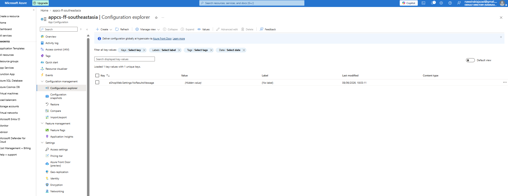
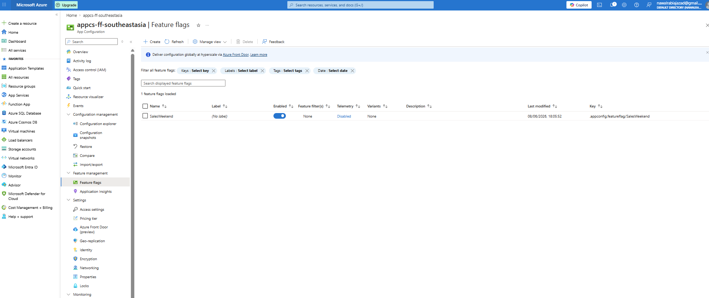
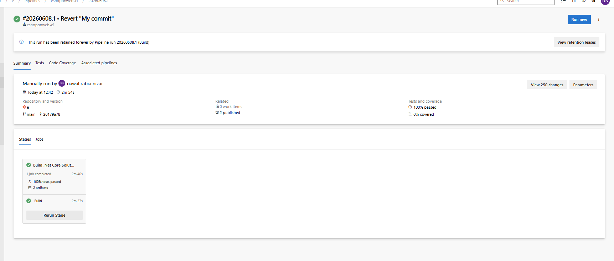
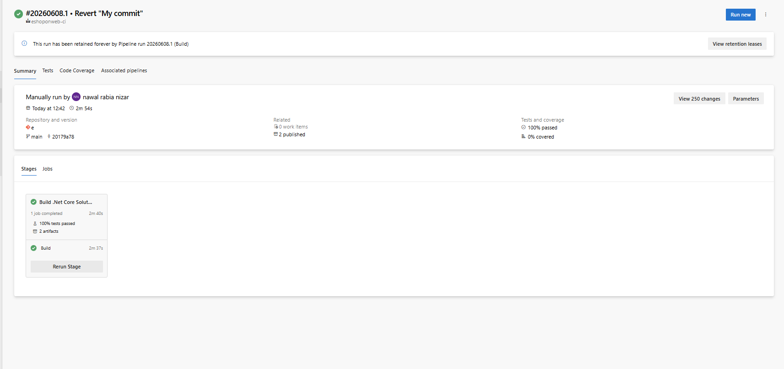
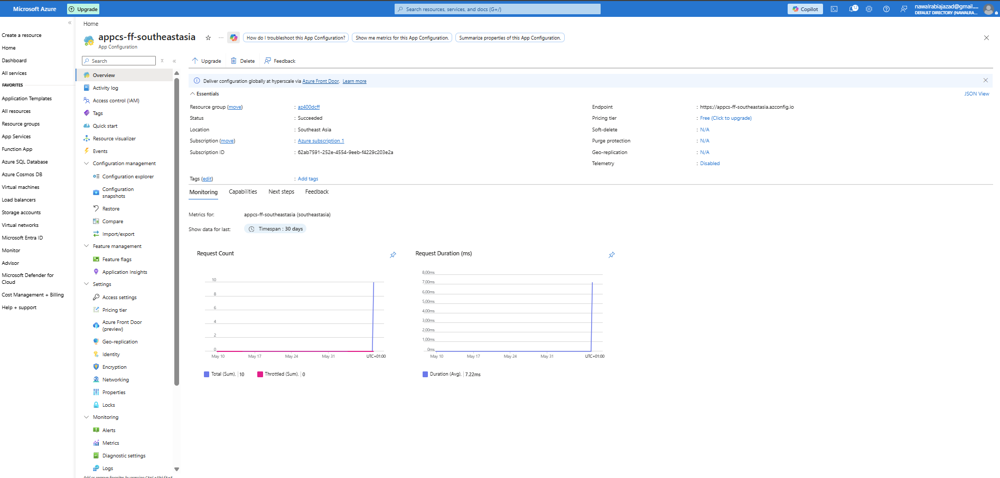
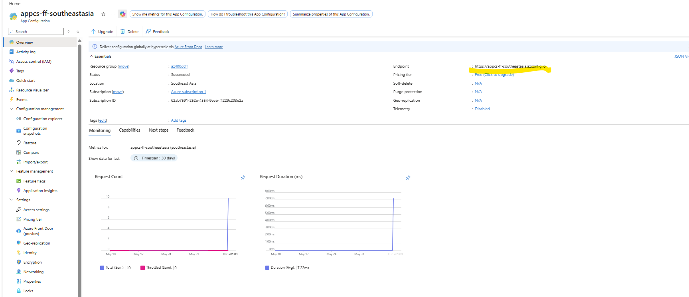
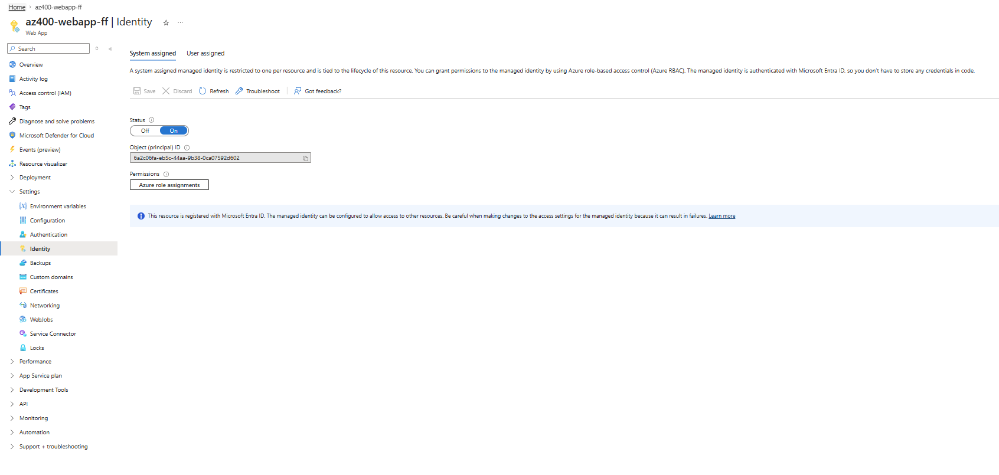
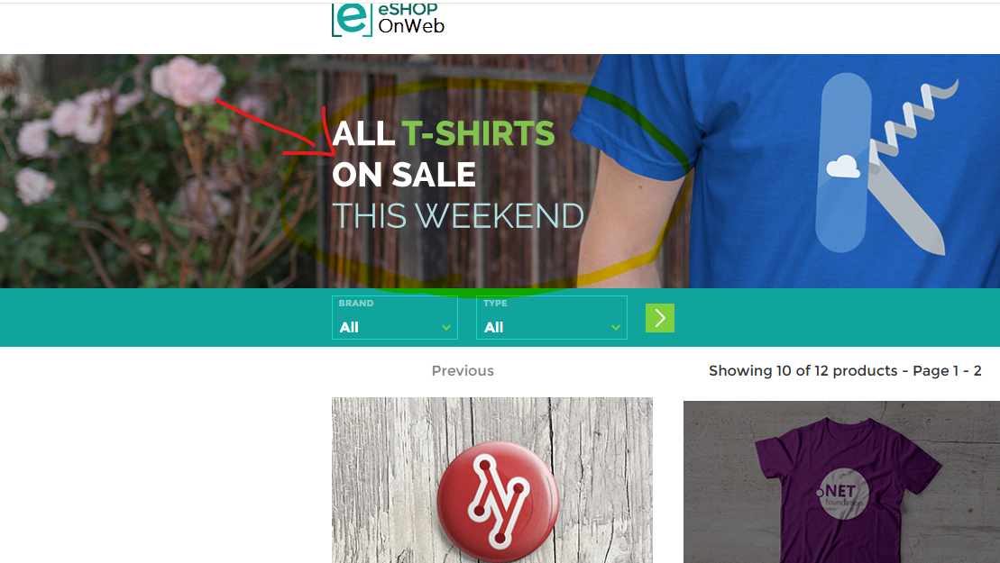

# 🚀 Azure App Configuration & Feature Flags with Azure DevOps

## 📌 Project Overview

This project demonstrates how to implement **dynamic configuration management** and **feature flags** using Azure App Configuration in an ASP.NET application deployed through Azure DevOps pipelines.

The solution allows application behavior and settings to be modified without code changes or redeployment.

---

## 🎯 Objectives

* Deploy an ASP.NET application using Azure DevOps pipelines
* Create and configure Azure App Configuration
* Enable Managed Identity authentication
* Implement dynamic configuration updates
* Manage application features using Feature Flags

---

## 🏗️ Solution Architecture

The solution consists of:

* Azure DevOps CI Pipeline
* Azure DevOps CD Pipeline
* Azure App Service (Web App)
* Azure App Configuration
* Managed Identity
* Feature Management
* Dynamic Configuration Refresh

```text
Azure DevOps Pipeline
          │
          ▼
    Azure Web App
          │
          ▼
Azure App Configuration
     │          │
     ▼          ▼
Configuration  Feature Flags
```

---

## 📁 Repository Structure

```text
.
├── .ado/
│   ├── eshoponweb-ci.yml
│   └── eshoponweb-cd-webapp-code.yml
│
├── screenshots/
│   ├── ci-pipeline.png
│   ├── cd-pipeline.png
│   ├── app-configuration.png
│   ├── managed-identity.png
│   ├── configuration-explorer.png
│   ├── feature-manager.png
│   └── website-result.png
│
└── README.md
```

---

## ⚙️ Implementation Steps

### 1. CI/CD Pipeline Setup

Configured Azure DevOps pipelines to:

* Build the application
* Run automated tests
* Deploy infrastructure and application code
* Automate releases

### CI Pipeline

* Restores dependencies
* Builds application
* Runs tests
* Publishes artifacts

### CD Pipeline

* Deploys Azure resources
* Deploys Web App
* Configures application settings

---

### 2. Azure App Configuration

Created an Azure App Configuration resource to centrally manage:

* Application settings
* Environment-specific values
* Feature flags

Benefits:

* Centralized configuration management
* No redeployment required
* Runtime configuration updates

---

### 3. Managed Identity Integration

Enabled System Assigned Managed Identity on the Azure Web App.

Assigned:

**App Configuration Data Reader**

role to allow secure access without storing secrets or connection strings.

---

### 4. Dynamic Configuration

Created a configuration key:

```text
eShopWeb:Settings:NoResultsMessage
```

Example:

```text
No products match your current search criteria.
```

Changes made in Azure App Configuration were automatically reflected in the running application without redeployment.

---

### 5. Feature Flags

Created a feature flag:

```text
SalesWeekend
```

When enabled:

* Promotional banner displayed

When disabled:

* Banner automatically hidden

This demonstrates feature toggling without application releases.

---

## 📸 Screenshots

### Azure DevOps CI Pipeline


### Azure DevOps CD Pipeline


### Azure App Configuration Resource


### Managed Identity Configuration


### Configuration Explorer



### Feature Manager



### Dynamic Configuration Result


---

## 🧠 Key Learnings

* Azure App Configuration fundamentals
* Dynamic configuration refresh
* Feature management in cloud-native applications
* Managed Identity authentication
* Secure application configuration
* Azure DevOps CI/CD integration

---

## ⚠️ Challenges Encountered

* Configuring Azure role assignments correctly
* Connecting Web App to Azure App Configuration
* Validating feature flag behavior
* Testing configuration refresh without redeployment

---

## 🛠️ Technologies Used

* Azure App Configuration
* Azure App Service
* Azure Managed Identity
* Azure DevOps
* YAML Pipelines
* ASP.NET Core
* Feature Management

---

## ✅ Results

Successfully implemented:

* Dynamic application configuration
* Runtime configuration updates
* Feature flag management
* Secure access via Managed Identity
* Automated deployment through Azure DevOps

---

## 📚 Skills Demonstrated

* Infrastructure & Configuration Management
* Continuous Deployment
* Azure App Services
* Azure App Configuration
* Feature Flag Management
* Identity & Access Management
* Azure DevOps Pipelines

---

## ⭐ Author

Portfolio project completed as part of Azure DevOps (AZ-400) hands-on lab exercises focusing on secure continuous deployment and dynamic application configuration.

## 📸 Screenshots

### Azure DevOps CI Pipeline


### Azure DevOps CD Pipeline


### Azure App Configuration Resource



### Managed Identity Configuration


### Configuration Explorer


### Feature Manager


### Dynamic Configuration Result


### Feature Flag Enabled
