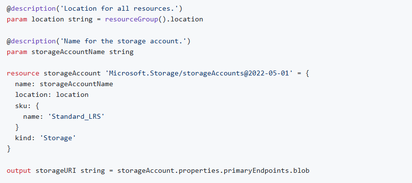
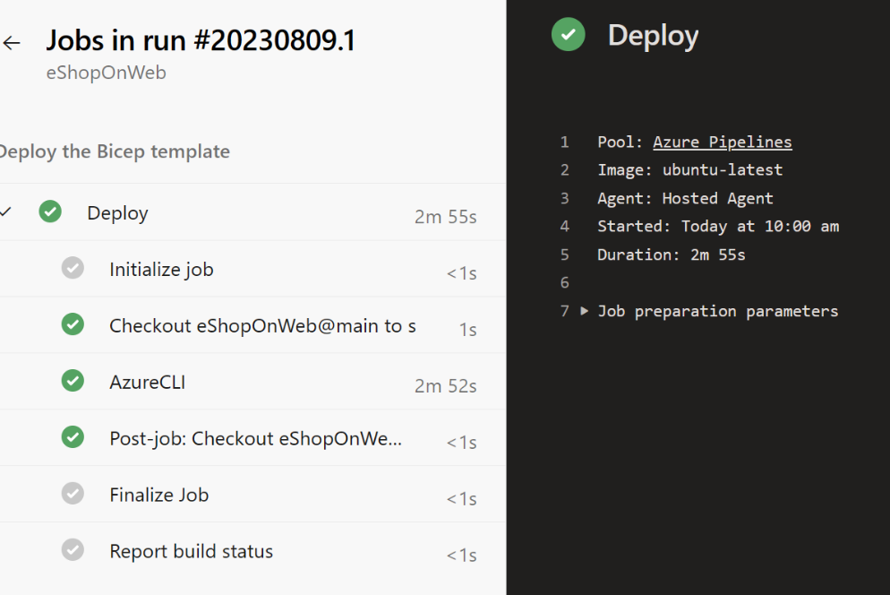

# 🚀 Azure Bicep VM Deployment with Modules & Azure DevOps Pipelines

This project demonstrates how to deploy Azure infrastructure using **Bicep Infrastructure-as-Code (IaC)** and automate deployments using **Azure DevOps YAML pipelines**.

---

## 📌 Overview

In this project, I built and deployed a **Windows Virtual Machine on Azure** using:

- Azure Bicep templates (Infrastructure as Code)
- Modular Bicep design (storage module)
- Azure networking resources (VNet, Subnet, NSG, Public IP)
- Azure DevOps CI/CD pipeline (YAML-based deployment)

---

## 🏗️ Architecture

The deployed infrastructure includes:

- 🖥️ Windows Server Virtual Machine
- 🌐 Virtual Network (VNet)
- 🔐 Network Security Group (RDP access on port 3389)
- 🌍 Public IP with DNS label
- 💾 Storage Account (boot diagnostics via module)
- 🔌 Network Interface (NIC)

---

## 📁 Repository Structure


infra/
├── simple-windows-vm.bicep # Main VM template
├── storage.bicep # Reusable storage module

screenshots/
├── create-project.png
├── import-repo.png
├── browsebicepfile.png
├── deploy.png


---

## ⚙️ What I Built

### 1. Azure Bicep Infrastructure

Defined infrastructure using declarative Bicep code:

- Virtual Machine provisioning
- Networking setup
- Security rules
- Boot diagnostics configuration

---

### 2. Bicep Module Implementation

Created a reusable storage module:

```bicep
module storageModule './storage.bicep' = {
  name: 'linkedTemplate'
  params: {
    location: location
    storageAccountName: storageAccountName
  }
}

This improves:

Code reuse
Maintainability
Separation of concerns

## 📸 Screenshots


### 🧱 Bicep Template Review


---

### 🚀 Successful Deployment
