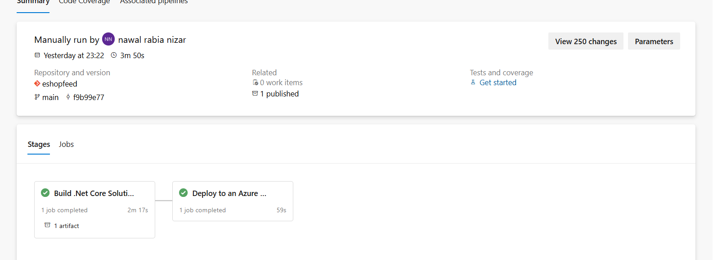
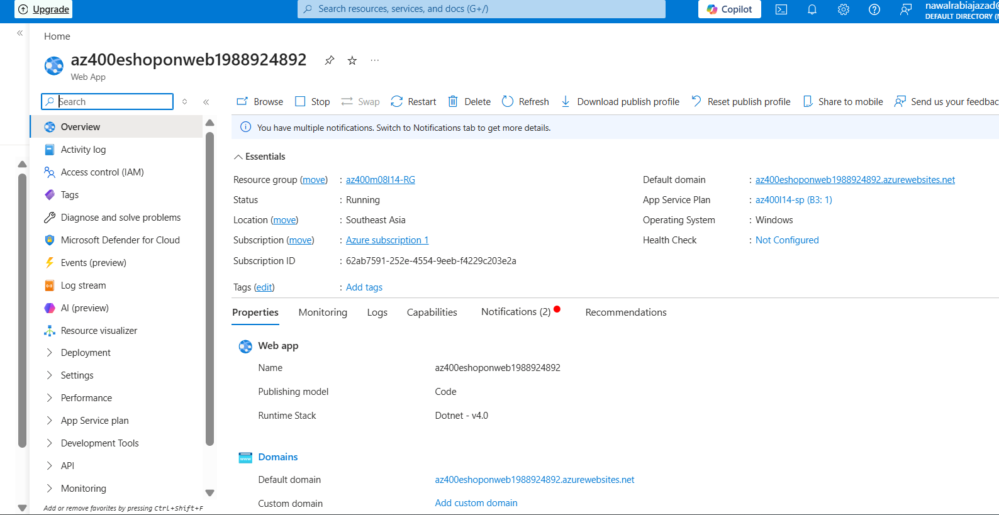
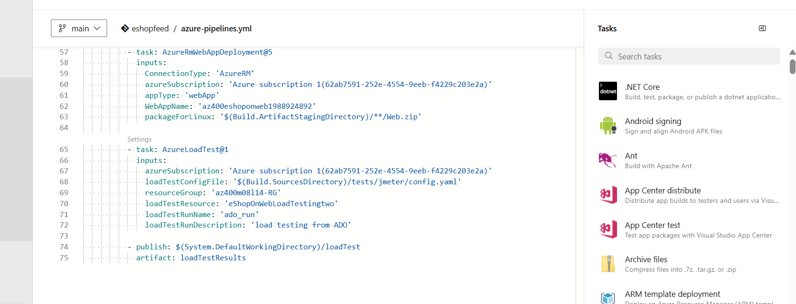
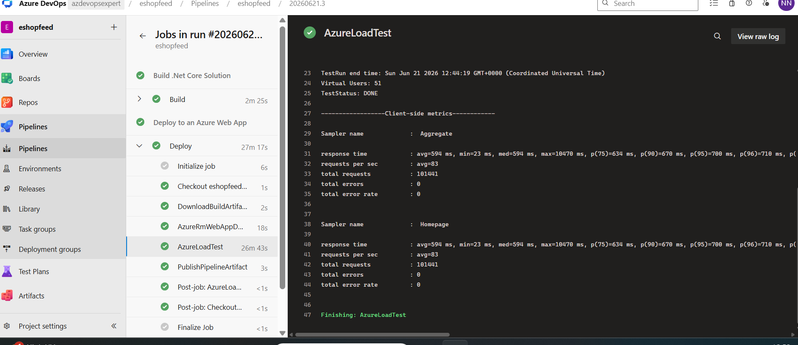
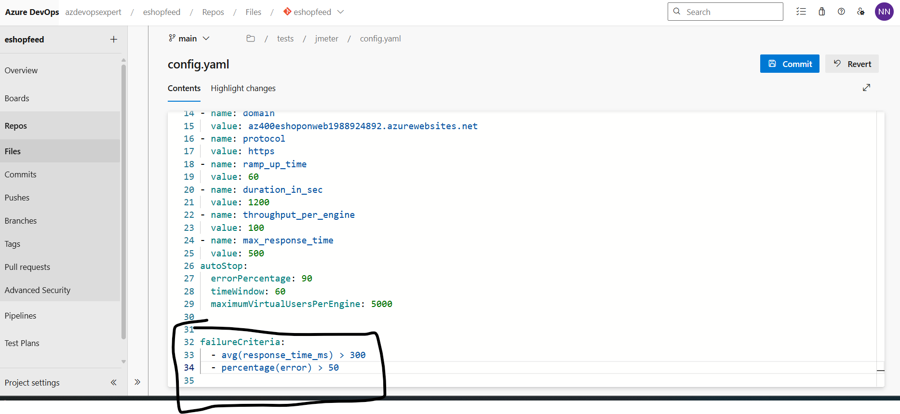

# Azure Load Testing with Azure DevOps CI/CD


## Project Overview

This project demonstrates how to implement a complete CI/CD workflow using Azure DevOps and Azure App Service, while integrating Azure Load Testing as a quality gate to validate application performance before release.

The solution deploys the eShopOnWeb ASP.NET Core application to Azure App Service and automatically executes performance tests using Azure Load Testing and Apache JMeter.

By integrating performance testing directly into the deployment pipeline, performance regressions can be detected before reaching production.

---

# Solution Architecture

<p align="center">
  
</p>

---

# Architecture Flow

```text
Developer Commit
        │
        ▼
 Azure Repos
        │
        ▼
 Azure DevOps Pipeline
        │
 ┌──────┴──────┐
 ▼             ▼
Build       Publish Artifact
        │
        ▼
Deploy to Azure App Service
        │
        ▼
Azure Load Testing
        │
        ▼
Performance Validation
        │
        ▼
Pass / Fail Release
```

---

# Technologies Used

* Azure DevOps
* Azure Pipelines (YAML)
* Azure App Service
* Azure Load Testing
* Apache JMeter
* ASP.NET Core (.NET 8)
* Azure Service Connections
* YAML-based Infrastructure Automation

---

# Key Features

### Continuous Integration

* Automated package restore
* Automated application build
* Automated artifact publishing
* Version-controlled pipeline

### Continuous Deployment

* Automated deployment to Azure App Service
* Zero manual deployment steps
* Repeatable deployments

### Performance Testing

* Azure Load Testing integration
* JMeter-based test execution
* Performance metrics collection
* Automated performance validation

### Quality Gates

The deployment pipeline validates application performance using predefined thresholds.

Example:

```yaml
failureCriteria:
  - avg(response_time_ms) > 300
  - percentage(error) > 50
```

If performance requirements are not met, the pipeline fails automatically.

---

# CI/CD Pipeline

## Pipeline Definition

The Azure DevOps pipeline contains two primary stages:

### Build Stage

* Restore NuGet packages
* Build ASP.NET Core application
* Publish application artifacts

### Deploy Stage

* Deploy application to Azure App Service
* Execute Azure Load Testing
* Publish test reports

---

# Azure DevOps Pipeline Execution

<p align="center">
  
</p>

The pipeline automates the complete software delivery lifecycle from source code to deployment and performance validation.

---

# Azure App Service Deployment

<p align="center">
  
</p>

The eShopOnWeb application is deployed automatically to Azure App Service using the AzureRmWebAppDeployment task.

---

# Azure Load Testing Configuration

The pipeline integrates Azure Load Testing using the Azure Load Testing Azure DevOps extension.

Example task:

```yaml
- task: AzureLoadTest@1
  inputs:
    azureSubscription: 'Azure Subscription'
    loadTestConfigFile: '$(Build.SourcesDirectory)/tests/jmeter/config.yaml'
    resourceGroup: 'ResourceGroup'
    loadTestResource: 'eShopOnWebLoadTesting'
    loadTestRunName: 'ado_run'
    loadTestRunDescription: 'load testing from Azure DevOps'
```

---

# Azure Load Test Execution

<p align="center">
  
</p>

Azure Load Testing executes the JMeter test plan and generates detailed performance reports.

---

# Performance Metrics

The load test captures:

* Average Response Time
* Throughput (Requests per Second)
* Error Rate
* Total Requests
* Response Time Percentiles (P90, P95, P99)

---

# Load Test Results

<p align="center">
  
</p>

These metrics help identify bottlenecks, scalability issues, and performance regressions before production deployment.

---

# Performance Quality Gates

To prevent slow-performing applications from being released, performance thresholds can be enforced.

Example:

```yaml
failureCriteria:
  - avg(response_time_ms) > 300
  - percentage(error) > 50
```

---

# Quality Gate Validation

<p align="center">
  
</p>

When performance metrics exceed the defined thresholds, Azure Load Testing returns a failed result, causing the deployment pipeline to fail automatically.

This ensures that only applications meeting performance requirements progress through the release process.

---

# Project Structure

```text
azure-load-testing-cicd/
│
├── README.md
│
├── images/
│   ├── architecture.png
│   ├── pipeline-success.png
│   ├── app-service-deployment.png
│   ├── load-test-pipeline.png
│   ├── load-test-results.png
│   └── failure-criteria.png
│
├── pipelines/
│   └── azure-pipelines.yml
│
├── tests/
│   └── jmeter/
│       ├── config.yaml
│       └── quick_test.jmx
│
└── docs/
    └── architecture.png
```

---

# Business Value

This implementation demonstrates how organizations can:

* Automate software delivery
* Validate performance before release
* Detect regressions early
* Improve application reliability
* Reduce production incidents
* Enable continuous feedback in DevOps workflows

---

# Skills Demonstrated

* Azure DevOps
* Azure Pipelines
* CI/CD Automation
* Azure App Service
* Azure Load Testing
* Apache JMeter
* YAML Pipelines
* Performance Engineering
* Continuous Feedback
* Release Quality Gates
* Cloud Deployment Automation

---

# Lessons Learned

Through this project I gained hands-on experience in:

* Building end-to-end CI/CD pipelines
* Deploying ASP.NET Core applications to Azure
* Creating and executing load tests
* Integrating Azure Load Testing into Azure Pipelines
* Defining automated performance validation criteria
* Implementing quality gates for production readiness

---

# Author

**Nawal Rabia **

Azure | DevOps | Cloud Engineering | Infrastructure Automation
